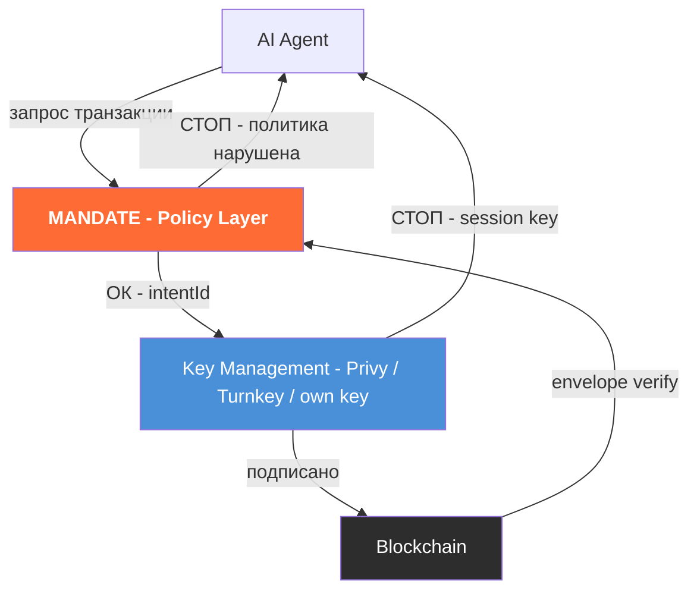
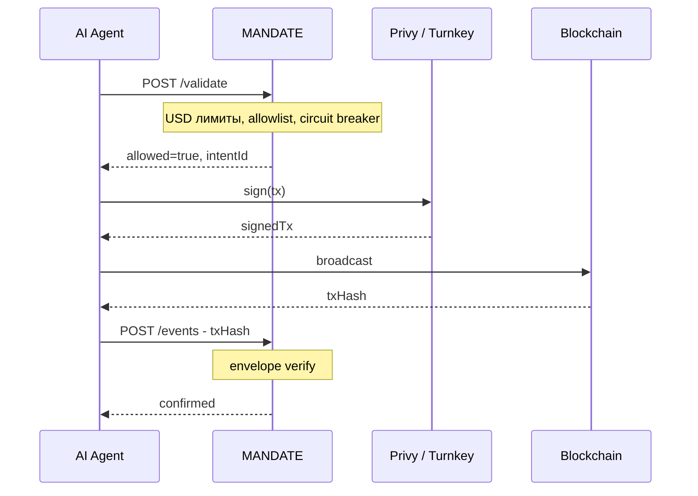
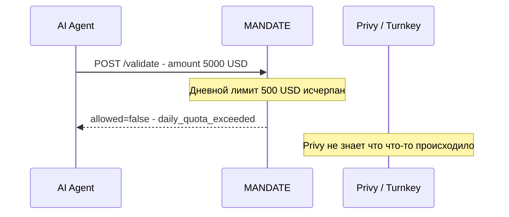

# Mandate: где мы в стеке

**Главный вопрос**: Если у Privy/Turnkey уже есть spend limits — зачем ещё Mandate? Нужно ли два session key?

**Ответ**: Нет. Mandate не выдаёт session keys. Mandate — API вызов **до** Privy. Privy не знает про Mandate. Разные уровни.

---

## Уровни стека

---

## Happy path

---

## Mandate блокирует — Privy не знает

---

## Что проверяет каждый слой

| | Privy / Turnkey | MANDATE |
|---|---|---|
| Блокирует | Сырые token amounts | 💵 USD-лимиты |
| Знает цену токена | ❌ | ✅ price oracle |
| Лимит в долларах | ❌ | ✅ per-tx / daily / monthly |
| Approval flow | ❌ | ✅ human-in-the-loop |
| Circuit breaker | ❌ | ✅ авто-блокировка |
| Audit trail | ⚠️ частично | ✅ полный intent log |
| Динамические политики | ❌ перевыпуск ключа | ✅ меняются без ключа |
| Твой ключ у них | ✅ да (TEE) | ❌ non-custodial |

---

## Circuit breaker: 3 примера аномалий

**Аномалия 1 — Velocity spike**
Агент обычно делает 3-5 транзакций в день. Вдруг за 10 минут — 47 транзакций. Возможно, агент взломан или зациклился. Circuit breaker отключает агента, уведомляет владельца.

**Аномалия 2 — Envelope mismatch**
Агент прошёл validate() на $50 → подписал → но в блокчейне транзакция на $4,800 (подмена в процессе подписи). Mandate детектирует несоответствие и трипает circuit breaker.

**Аномалия 3 — New recipient pattern**
Агент всегда отправлял на 3 известных адреса. Внезапно — новый неизвестный адрес + сумма близкая к дневному лимиту. Флаг: требует одобрения человека перед исполнением.

---

## Три сценария

**A. Mandate без Privy**
Agent → Mandate.validate() → sign locally → broadcast → Mandate.postEvent()

**B. Mandate + Privy — максимальная защита**
Agent → Mandate.validate() → Privy.sign() → broadcast → Mandate.postEvent()

**C. Только Privy**
Agent → Privy.sign() → broadcast — нет USD-политик, нет approval, нет circuit breaker

---

## Главное

**Privy защищает ключ. Mandate защищает от того, что агент делает с этим ключом.**

Privy — сейф. Mandate — правила того, что агентам разрешено делать. Не конкурируют, соседние слои.

---

*"Mandate — это правила для AI агентов с деньгами. Агент не может их нарушить, даже если захочет."*

*app.mandate.md*
